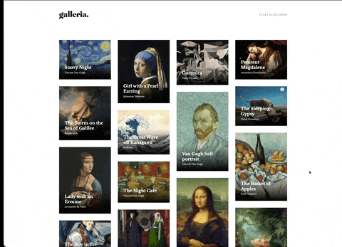

# galleria.

An interactive and elegant art gallery, featuring famous masterpieces with a modern and responsive design.

## 🎬 Demo



## 🎨 About the Project

**galleria.** is a web application that displays a curated collection of iconic paintings from art history. The project features a masonry grid gallery with slideshow functionality, allowing users to explore each artwork with detailed information about the artist, creation year, and historical context.

## ✨ Features

- **Masonry Grid Layout**: Responsive grid implemented with **Pure JavaScript**, without using external libraries.
- **Interactive Slideshow**: Smooth navigation between artworks with fluid animations.
- **Responsive Design**: Layout adaptable to different screen sizes.
- **Detailed Information**: Each piece includes description, artist, year, and a link to the source.
- **Optimized Performance**: Optimized assets and efficient bundle.

## 🛠️ Technologies

This project was developed using **only fundamental front-end technologies**, without UI frameworks or libraries:

- **HTML5**
- **CSS3**
- **JavaScript (ES6+)**

### Module Bundler

The project uses **Webpack** as a module bundler, configured **manually** to meet specific project needs:

- Custom Webpack configuration
- Loaders for CSS and assets
- HtmlWebpackPlugin for HTML generation
- CopyWebpackPlugin for static assets
- Webpack Dev Server for local development with hot reload

## 🎯 Technical Highlights

### Masonry Grid with Pure JavaScript

I implemented the masonry grid layout **from scratch using Pure JavaScript**, avoiding libraries like Masonry.js or Isotope. This decision demonstrates a solid grasp of DOM manipulation and layout algorithms. The implementation:

- Dynamically calculates element positioning.
- Automatically adapts to window resizing.
- Optimizes vertical spacing between items.
- Maintains high performance even with many elements.

### Manual Webpack Configuration

Instead of using abstraction tools like 'Create React App', I **manually configured Webpack**, including loaders and optimization settings. This approach shows my deep understanding of the front-end "under the hood" and gives me full control over the build process. The configuration includes:

- Setup of loaders for different asset types.
- Bundle size optimization.
- Selective copying of static assets.
- Custom development server configuration.

## 🚀 How to Run the Project

### Prerequisites

- Node.js (version 14 or higher)
- npm or yarn

### Installation

1. Clone the repository:

```bash
git clone https://github.com/orafael93/galleria.git
cd galleria
```

2. Install dependencies:

```bash
npm install
```

### Development

To run the project in development mode with hot reload:

```bash
npm start
```

The project will automatically open in your browser at `http://localhost:8080`.

### Production Build

To generate the optimized bundle for production:

```bash
npm run build
```

The optimized files will be generated in the `dist/` folder.

## 📝 Included Works

The gallery features 15 masterpieces, including:

- **Starry Night** - Vincent Van Gogh (1889)
- **Girl with a Pearl Earring** - Johannes Vermeer (1665)
- **Guernica** - Pablo Picasso (1937)
- **Mona Lisa** - Leonardo da Vinci (1503)
- And many others...

## 👨‍💻 Author

**Rafael Pereira**

- Email: orafaeldev@gmail.com
- GitHub: [@orafael93](https://github.com/orafael93)
